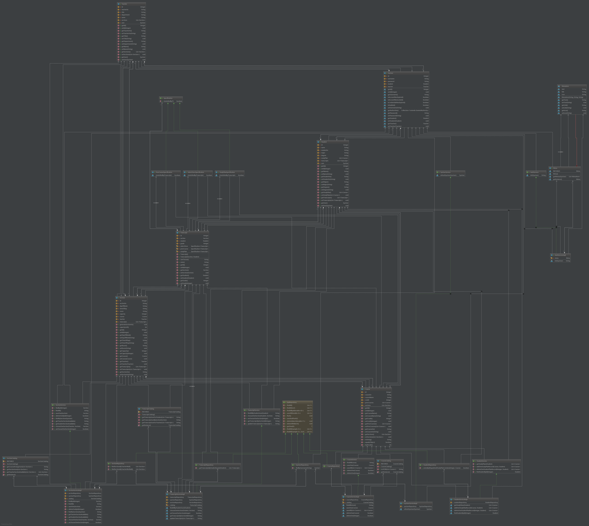

# MIS
## 用例分析
### 用例图

### 用例描述

## 实现
后端：SpringBoot(Spring,SpringMVC,SpringSecurity,Spring Data JPA)

前端：Angular+[ng-zorro](https://ng.ant.design/components/button/zh)+[ng-alain](https://ng-alain.com/)
## 项目结构

## 数据库结构

## 领域模型

## 功能界面
### 登陆

### 课程管理(CRUD)

### 教务排课

### 教师选课

### 学习计划

### 学生选课
#### WaitList

#### 已选规约

#### 学习计划规约

#### 先修课规约

### 教师查看选课名单+成绩录入

### 成绩查询
